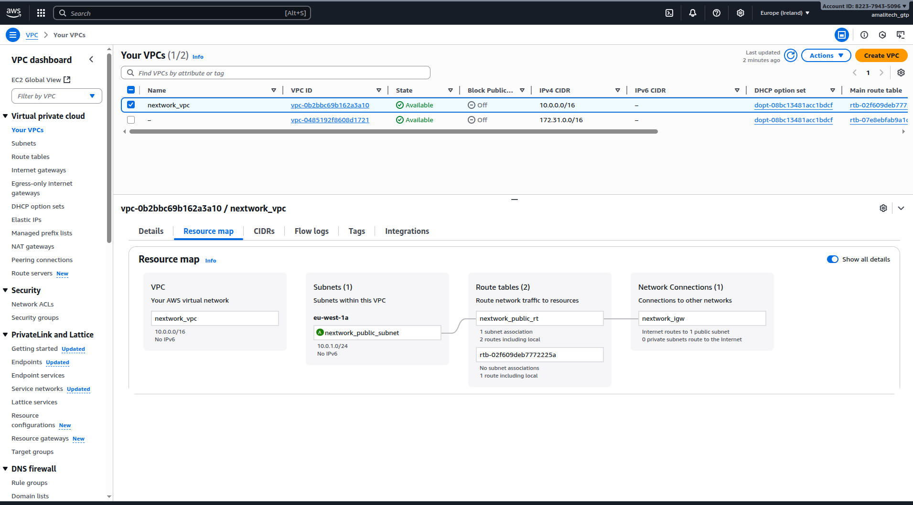
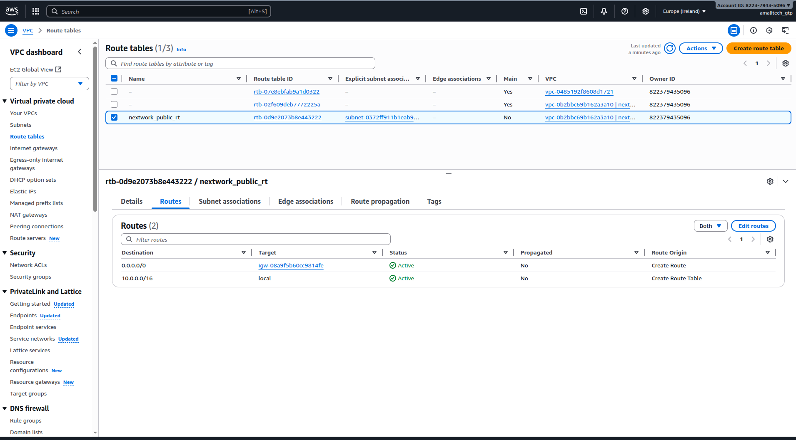

# Lab 1: VPC Foundation - Complete Implementation

## Overview

This lab demonstrates the successful creation of a Virtual Private Cloud (VPC) infrastructure, forming the foundation for all subsequent networking labs. I built a secure, scalable VPC with proper subnet configuration and internet connectivity.

## What I Accomplished

✅ **Created a custom VPC** with CIDR block configuration
✅ **Set up a public subnet** for internet-accessible resources
✅ **Configured an Internet Gateway** for external connectivity
✅ **Associated route tables** for proper traffic routing

## Implementation Details

### VPC Configuration
- Created a custom VPC with appropriate CIDR block
- Configured DNS resolution and DNS hostnames
- Established the network foundation for multi-tier architecture

### Public Subnet Setup
- Designed public subnet with proper CIDR allocation
- Enabled auto-assign public IP for instances
- Configured for internet-facing resources

### Internet Gateway & Routing
- Attached Internet Gateway to VPC
- Updated route table to direct traffic to IGW
- Established internet connectivity path

## Key Learning Outcomes

- **VPC Design Principles**: Understanding of network segmentation and CIDR planning
- **Internet Connectivity**: Configuration of gateways and routing for external access
- **AWS Networking Fundamentals**: Hands-on experience with core VPC components

## Visual Documentation

### VPC Creation Process

*Screenshot showing the VPC creation configuration and settings*

### Route Table Association

*Screenshot demonstrating the route table association with the public subnet*

## Technical Skills Demonstrated

- AWS VPC configuration and management
- Network CIDR planning and subnet design
- Internet Gateway setup and routing configuration
- Understanding of public vs private network segments

## Next Steps

This VPC foundation enables:
- Security group and NACL implementation (Lab 2)
- Private subnet creation (Lab 3)
- EC2 instance deployment (Lab 4)
- Advanced networking features in subsequent labs