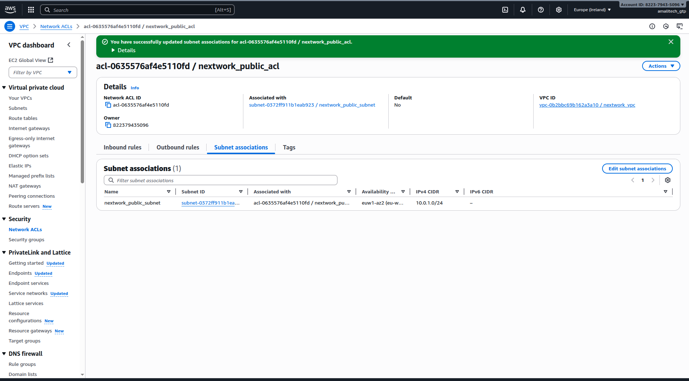
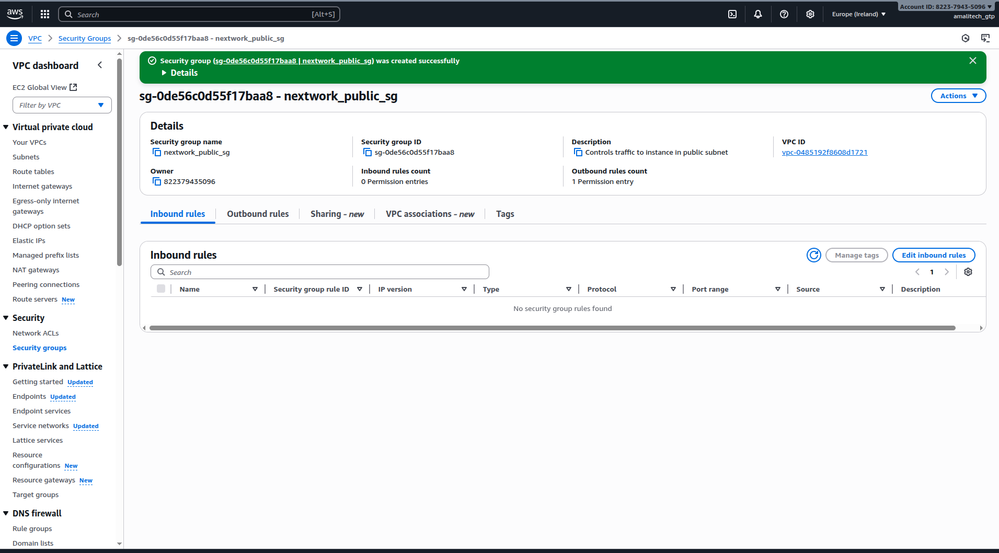

# Lab 2: VPC Traffic Flow and Security - Complete Implementation

## Overview

This lab demonstrates the successful implementation of multi-layered network security controls within the VPC. I configured both Network Access Control Lists (NACLs) and Security Groups to establish comprehensive traffic management and security policies.

## What I Accomplished

✅ **Implemented Network ACLs** for subnet-level traffic control
✅ **Configured Security Groups** for instance-level security
✅ **Established traffic filtering** at multiple network layers
✅ **Applied security best practices** for network access control

## Implementation Details

### Network Access Control Lists (NACLs)
- Created custom NACL rules for inbound and outbound traffic
- Configured stateless filtering at the subnet level
- Associated NACLs with appropriate subnets
- Implemented deny-by-default security posture

### Security Groups Configuration
- Designed security group rules for specific application needs
- Configured stateful filtering at the instance level
- Implemented least-privilege access principles
- Set up rules for SSH, HTTP, and other required protocols

## Key Learning Outcomes

- **Defense in Depth**: Understanding of layered security architecture
- **Stateful vs Stateless**: Practical experience with different filtering approaches
- **Traffic Control**: Implementation of granular network access policies
- **Security Best Practices**: Application of AWS security recommendations

## Visual Documentation

### Network ACL Creation and Association

*Screenshot showing the Network ACL creation process and subnet association*

### Security Group Configuration

*Screenshot demonstrating security group rule configuration and management*

## Technical Skills Demonstrated

- Network Access Control List (NACL) configuration
- Security Group rule management
- Understanding of stateful vs stateless filtering
- Implementation of network security best practices
- Traffic flow analysis and control

## Security Architecture

This implementation provides:
- **Subnet-level protection** through NACLs
- **Instance-level security** via Security Groups
- **Layered defense** against unauthorized access
- **Flexible rule management** for different use cases

## Integration with Overall Architecture

These security controls work with:
- VPC foundation from Lab 1
- Private subnets in Lab 3
- EC2 instances in Lab 4
- All subsequent networking components
