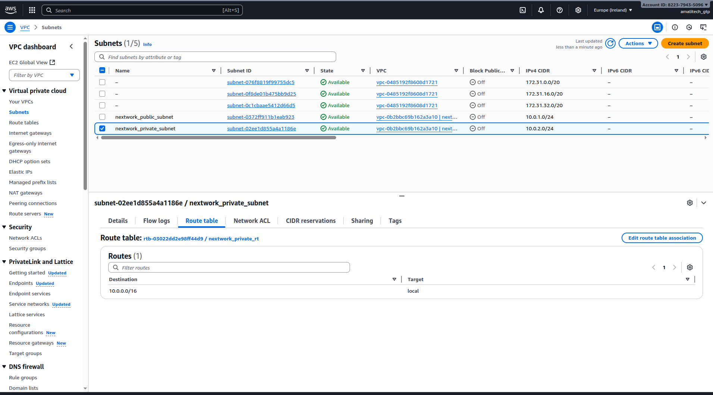
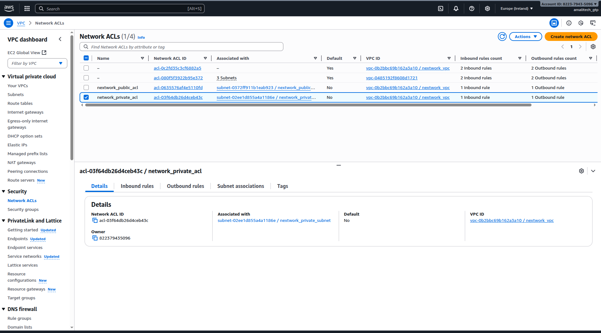

# Lab 3: Private Subnet Creation - Complete Implementation

## Overview

This lab demonstrates the successful creation of private subnets within the VPC, establishing isolated network segments for backend resources. I implemented proper network segmentation to separate public-facing and internal resources.

## What I Accomplished

✅ **Created private subnets** for isolated resource deployment
✅ **Implemented network segmentation** between public and private tiers
✅ **Associated custom NACLs** for enhanced security
✅ **Established foundation** for multi-tier architecture

## Implementation Details

### Private Subnet Configuration
- Designed private subnets with appropriate CIDR allocation
- Configured subnets without direct internet access
- Planned for future NAT Gateway implementation
- Established proper availability zone distribution

### Network Segmentation
- Separated public and private network tiers
- Implemented security boundaries between subnet types
- Configured routing for internal communication
- Prepared infrastructure for database and application tiers

### Security Association
- Applied custom Network ACLs to private subnets
- Configured restrictive access policies
- Implemented additional security layers
- Ensured compliance with security best practices

## Key Learning Outcomes

- **Network Segmentation**: Understanding of multi-tier architecture design
- **Private Networking**: Configuration of isolated network segments
- **Security Boundaries**: Implementation of network isolation
- **Scalable Design**: Planning for future resource deployment

## Visual Documentation

### Private Subnet Creation

*Screenshot showing the private subnet creation process and configuration*

### Network ACL Association

*Screenshot demonstrating the association of Network ACLs with private subnets*

## Technical Skills Demonstrated

- Private subnet design and implementation
- Network segmentation strategies
- NACL configuration for private networks
- Multi-tier architecture planning
- Security boundary establishment

## Architecture Benefits

This private subnet implementation provides:
- **Enhanced Security**: Isolated environment for sensitive resources
- **Network Segmentation**: Clear separation of public and private tiers
- **Scalability**: Foundation for complex multi-tier applications
- **Compliance**: Adherence to security best practices

## Integration Points

These private subnets integrate with:
- Public subnets from Lab 1
- Security controls from Lab 2
- EC2 instances in Lab 4
- VPC peering and endpoints in later labs
