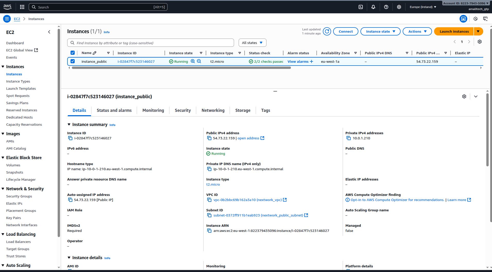

# Lab 4: VPC Resource Deployment - Complete Implementation

## Overview

This lab demonstrates the successful deployment of EC2 instances within the VPC infrastructure. I launched and configured instances in public subnets, establishing the compute foundation for network testing and application deployment.

## What I Accomplished

✅ **Launched EC2 instances** in public subnets
✅ **Configured instance networking** with proper security groups
✅ **Established compute resources** for connectivity testing
✅ **Prepared infrastructure** for application deployment

## Implementation Details

### EC2 Instance Configuration
- Selected appropriate instance types for testing purposes
- Configured instances with public IP addresses
- Applied security groups from Lab 2
- Set up key pairs for secure SSH access

### Network Integration
- Deployed instances in public subnets
- Verified internet connectivity through Internet Gateway
- Configured security group rules for required access
- Established foundation for multi-instance communication

## Key Learning Outcomes

- **Instance Deployment**: Practical experience with EC2 in VPC environment
- **Network Configuration**: Understanding of instance-level networking
- **Security Integration**: Application of security groups to running instances
- **Infrastructure Planning**: Preparation for scalable deployments

## Visual Documentation

### Public Instance Launch

*Screenshot showing the EC2 instance launch process in the public subnet*

## Technical Skills Demonstrated

- EC2 instance deployment in VPC
- Network interface configuration
- Security group application
- Public subnet resource management
- SSH key pair management

## Resource Architecture

This deployment establishes:
- **Compute Foundation**: Running instances for testing and applications
- **Network Validation**: Resources to verify connectivity
- **Security Implementation**: Applied security controls in practice
- **Scalability Base**: Framework for additional resource deployment
