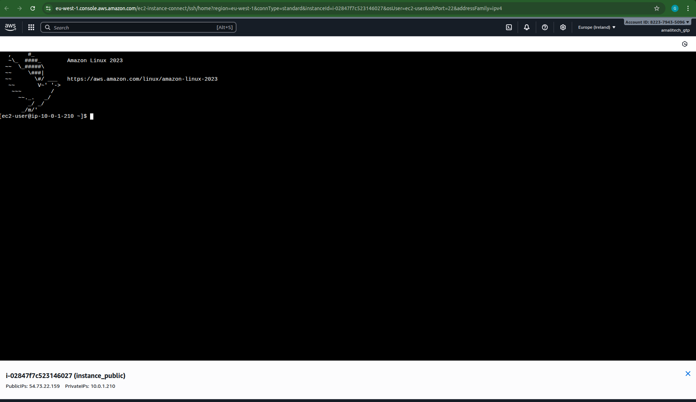

# Lab 5: VPC Connectivity Testing - Complete Implementation

## Overview

This lab demonstrates successful network connectivity validation within the VPC infrastructure. I performed comprehensive testing to verify that all network components function correctly and securely.

## What I Accomplished

✅ **Verified SSH connectivity** to EC2 instances
✅ **Tested network communication** between resources
✅ **Validated security group rules** in practice
✅ **Confirmed internet connectivity** through IGW

## Implementation Details

### Connectivity Testing
- Established SSH connections to public instances
- Verified security group rule effectiveness
- Tested internet connectivity from instances
- Validated network routing configuration

### Network Validation
- Confirmed proper DNS resolution
- Tested internal network communication
- Verified security boundaries
- Validated traffic flow through network layers

## Visual Documentation

### SSH Connection Success

*Screenshot showing successful SSH connection to the EC2 instance*

## Technical Skills Demonstrated

- Network connectivity troubleshooting
- SSH configuration and access
- Security group validation
- Network routing verification
- Infrastructure testing methodologies
