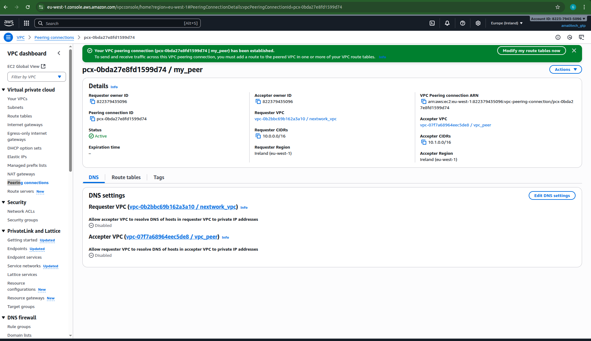
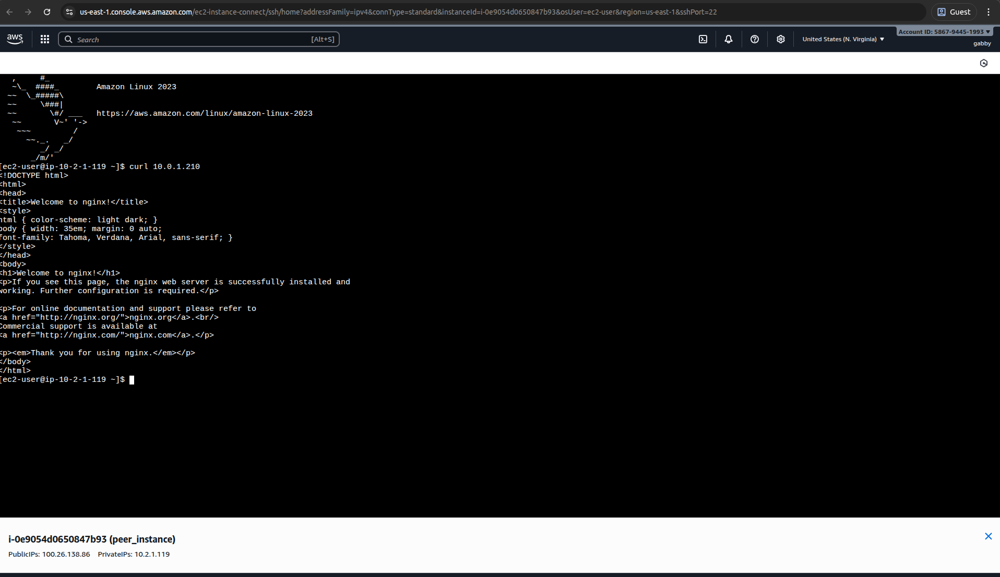

# Lab 6: VPC Peering - Complete Implementation

## Overview

This lab demonstrates successful implementation of VPC peering connections, enabling secure communication between multiple VPCs. I established cross-VPC connectivity while maintaining network isolation and security.

## What I Accomplished

✅ **Created VPC peering connections** between multiple VPCs
✅ **Configured cross-VPC routing** for seamless communication
✅ **Tested private IP connectivity** between peered instances
✅ **Maintained security boundaries** across VPC boundaries

## Implementation Details

### VPC Peering Setup
- Established peering connections between VPCs
- Configured route tables for cross-VPC traffic
- Updated security groups for peered access
- Validated CIDR block compatibility

### Cross-VPC Communication
- Tested connectivity using private IP addresses
- Verified routing between peered VPCs
- Confirmed security group effectiveness
- Established secure inter-VPC communication

## Visual Documentation

### VPC Peering Configuration

*Screenshot showing the VPC peering connection configuration*

### Private IP Access Validation

*Screenshot demonstrating successful access using private IP of peered instance*

## Technical Skills Demonstrated

- VPC peering connection management
- Cross-VPC routing configuration
- Inter-VPC security implementation
- Private network communication
- Multi-VPC architecture design
