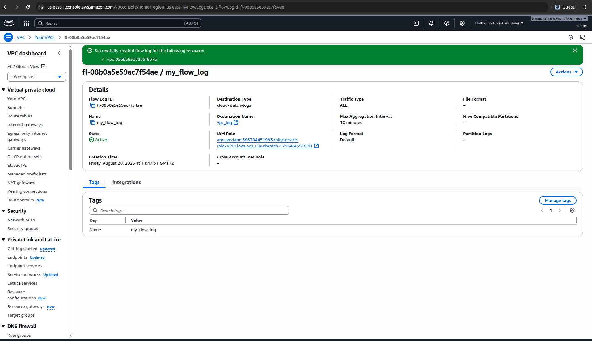
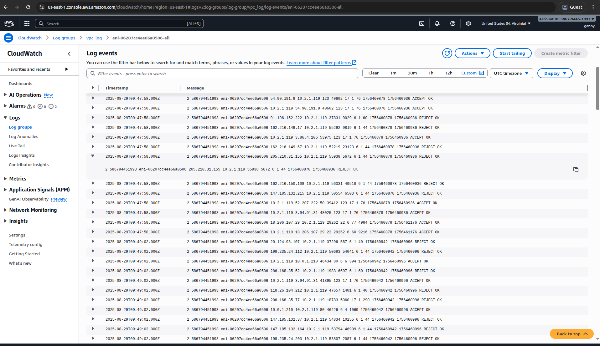

# Lab 7: VPC Flow Logs Monitoring - Complete Implementation

## Overview

This lab demonstrates successful implementation of VPC Flow Logs for comprehensive network monitoring and traffic analysis. I established logging infrastructure to track, analyze, and secure network communications.

## What I Accomplished

✅ **Implemented VPC Flow Logs** for traffic monitoring
✅ **Configured log collection** and storage
✅ **Established network visibility** for security analysis
✅ **Set up monitoring infrastructure** for ongoing operations

## Implementation Details

### Flow Logs Configuration
- Created VPC Flow Logs for traffic capture
- Configured log destination and format
- Set up appropriate IAM roles and permissions
- Established log retention policies

### Monitoring Setup
- Implemented comprehensive traffic logging
- Configured log analysis capabilities
- Established security monitoring baseline
- Prepared for traffic pattern analysis

## Visual Documentation

### Flow Log Creation

*Screenshot showing the VPC Flow Log creation and configuration process*

### Flow Log Data

*Screenshot displaying actual VPC Flow Log data and traffic information*

## Technical Skills Demonstrated

- VPC Flow Logs implementation
- Network traffic monitoring
- Log analysis and interpretation
- Security monitoring setup
- Network visibility configuration
