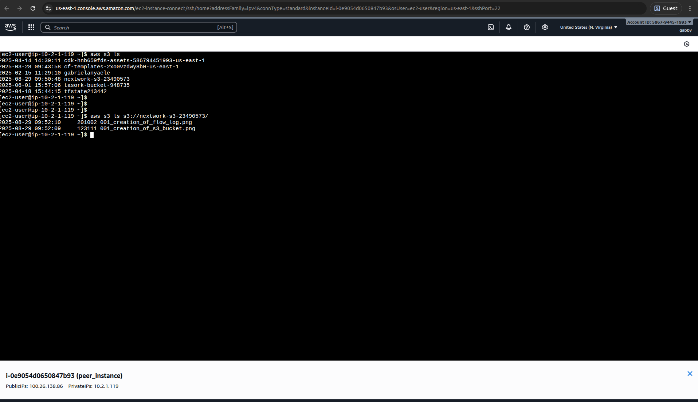

# Lab 8: S3 VPC Integration - Complete Implementation

## Overview

This lab demonstrates successful integration of S3 storage services with VPC resources. I established secure connectivity between VPC instances and S3, implementing best practices for cloud storage access.

## What I Accomplished

✅ **Created S3 bucket** for VPC resource access
✅ **Configured secure S3 connectivity** from VPC instances
✅ **Implemented IAM policies** for controlled access
✅ **Established data transfer workflows** between VPC and S3

## Implementation Details

### S3 Bucket Configuration
- Created S3 bucket with appropriate settings
- Configured bucket policies for VPC access
- Implemented security best practices
- Set up proper access controls

### VPC-S3 Integration
- Configured EC2 instances for S3 access
- Implemented IAM roles and policies
- Established secure data transfer methods
- Validated connectivity and permissions

## Visual Documentation

### S3 Bucket Creation

*Screenshot showing the S3 bucket creation process and configuration*

### S3 Access from VPC

*Screenshot demonstrating successful S3 access from VPC resources*

## Technical Skills Demonstrated

- S3 bucket creation and management
- VPC-S3 integration
- IAM policy configuration
- Secure cloud storage access
- Data transfer optimization
