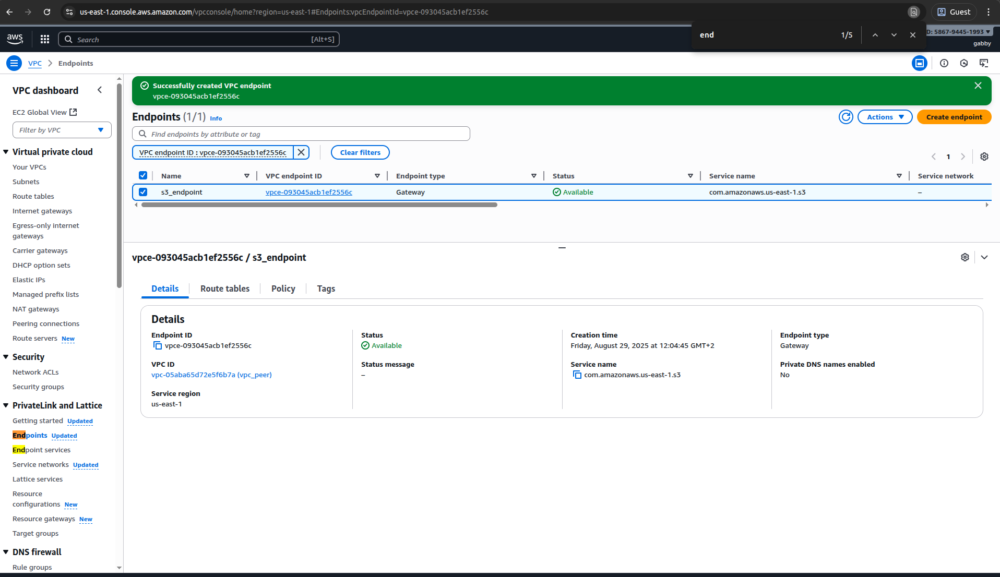

# Lab 9: VPC Endpoints - Complete Implementation

## Overview

This lab demonstrates successful implementation of VPC Endpoints to optimize connectivity to AWS services. I created private connections to AWS services, reducing costs and improving security by avoiding internet routing.

## What I Accomplished

✅ **Created VPC Endpoints** for AWS service connectivity
✅ **Implemented private connectivity** to AWS services
✅ **Reduced data transfer costs** by avoiding internet routing
✅ **Enhanced security** with private service access

## Implementation Details

### VPC Endpoint Configuration
- Created Gateway and Interface endpoints
- Configured endpoint policies for security
- Associated endpoints with appropriate subnets
- Implemented cost-effective service connectivity

### Service Optimization
- Established private connectivity to AWS services
- Configured routing for endpoint traffic
- Implemented security policies for service access
- Optimized network performance and costs

## Visual Documentation

### VPC Endpoint Creation

*Screenshot showing the VPC Endpoint creation process and configuration*

## Technical Skills Demonstrated

- VPC Endpoint implementation
- AWS service connectivity optimization
- Cost reduction strategies
- Private network service access
- Network performance optimization

## Project Completion

This final lab completes the comprehensive AWS networking series, demonstrating:
- **Complete VPC Architecture**: From basic VPC to advanced connectivity
- **Security Implementation**: Multi-layered network security
- **Performance Optimization**: Cost-effective and secure service connectivity
- **Monitoring & Logging**: Comprehensive network visibility
- **Best Practices**: Industry-standard AWS networking implementation
